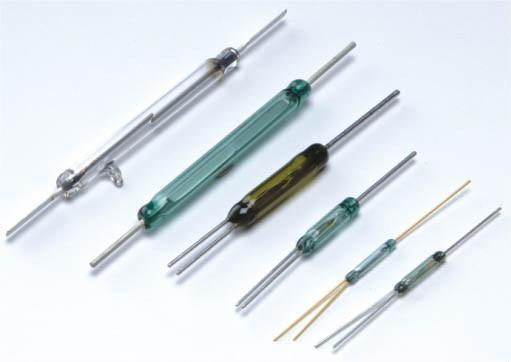

# 3. 門窗感測
Copyright &copy; 2019 Mickey Chan. ALL RIGHTS RESERVED.  

## 功能
* 感測門是否被開啟；
* 門被開啟時亮起紅色 LED ，並發出警號

## 零件表
* 1 x ESP32 官方開發板（或兼容板）；
* 1 x 門窗感測器（磁力開關 ＋ 磁石）；
* 1 x 紅色 LED；
* 1 x 220 Ohms 電阻；
* 1 x 主動式蜂鳴器

## 門窗感測器

磁力開關（ Reed switch ），又稱為干簧管，常見的是一支小玻璃管，裡面封裝了簧片和惰性氣體，當有磁力靠近時就會閉合通電。而門窗感測器就是把玻璃管封裝在匣子裡，並附上一粒不太強的磁石。安裝在門和門框上，就能感測門窗的開關狀態。

有部分門窗感測器／磁力開關更像繼電器一樣有三支電極，即常開（ NO ，有磁場時接通）、常閉（ NC ，沒有磁場時接通）和 COM ，讓大家可以對不同的磁場狀況作不同處理。

## 蜂鳴器種類
### 主動式蜂鳴器
* 有正負電極之分；
* 只要通電，就能利用內藏的發震器來發聲；
* 給予方形波可以產生不同頻率的聲音

### 被動式蜂鳴器
* 沒有正負極之分；
* 必須給予方形波或交流電才可以產生指定頻率的聲音；
* 使用起來像一般喇叭

## 接線
* 門窗感測器其中一支電極直接連接 GPIO16 （使用內部 Pull-up），另一電極接地；
* GPIO4 連到紅色 LED ，經 220 Ohm 電阻接地；
* GPIO33 連接到主動式蜂鳴器正極，蜂鳴器負極接地

### 線路圖

### 麵包板

## 草稿碼
* 當 GPIO16 （門窗感測器）電壓為 HIGH （門啟）時，將 GPIO4 （紅色 LED）和 GPIO33 （蜂鳴器）設為 HIGH；
* 當 GPIO16 （門窗感測器）電壓為 LOW （門啟）時，將 GPIO4 （紅色 LED）和 GPIO33 （蜂鳴器）設為 LOW

[門窗感測草稿碼](session_3_1.ino)

## 完整電門鎖電路
### 線路圖

### 麵包板

## 草稿碼
* 當 GPIO17 處於 HIGH （解鎖）時，如果 GPIO16 同樣被設為 HIGH （開門），即暫停自動重新上鎖；
* 當 GPIO16 回復為 LOW （關門）後，延遲 1.5 秒後將 GPIO17 設為 LOW

[完整電門鎖草稿碼](session_3_2.ino)
